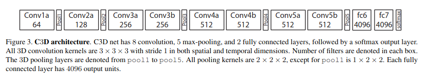

Bu çalışma "YAPAY ZEKA DİL AJANLARI YARIŞMASI (3. Senaryo)" için geliştirilmiştir. 

Yarışma isterleri aşağıdkai gibi not edilmiştir:

Sistem video girdisi alır ve;\
1- video içindeki anormal durumların tespiti yapar.\
2- anormal anları türkçe dilinde ifade eder.\
3- genel video ozeti çıkarabilir.\
4- anormal anlara aksiyon önerileri sunar.\
5- model servisleme altyapsına sahip olamlıdır.\
6- aşağıdaki gibi bir çıktı ile dışarıya bilgi verir.
```JSON
{
    "summary": "Videoda forklift kazası ve yaralanma riski gözlenmiştir.",
    "events": [
        {"time": "00:15", "event": "Forklift devrildi"},
        {"time": "00:20", "event": "Yerde hareketsiz kişi"}
    ],
    "risk": "Yüksek",
    "actions": [
        "Sağlık ekibini çağır",
        "Alanı güvenlik altına al"
    ]
}
```

Bu isterler adım adım uygulanarak ilerlenmiştir. 

## İster 1: Video içindeki anormal durumların tespiti yapar:

Sistemin bunu gerçekleştirebilmesi için videoyo sekans halinde işlemesi ve hangi anlarda anormal durumun gerçekleştiğini segmente edebilmesi gerekmektedir. Bu işlem için öncelikle literaturde yapılan çalışmaların incelenmesine karar verilmiştir. 

"Anomaly Detection in Surveillance Videos" şekilnde yapılan literatür taraması sonrası, 2018 yılında yapılan "[Real-world Anomaly Detection in Surveillance Videos](https://openaccess.thecvf.com/content_cvpr_2018/papers/Sultani_Real-World_Anomaly_Detection_CVPR_2018_paper.pdf)" çalışması görülmüştrü. 

Bu çalışma incelendiğinde iki büyük önemli nokta üzerine geliştirme yaptığı anlaşılmıştır:

- Çalışma kapsamında tam 102 GB büyüklüğünde 1900 videodan oluşan 128 saat'lik video veri seti oluşturulnmuştur. Veri setindeki videolar video tabanlı etiketlenmiştir. Bu etiketler aşağidaki gibidir:
    - Şiddet
    - Haneye tecavüz
    - Soygun
    - Hırsızlık
    - Silahlı saldırı
    - Mağaza hırsızlığı
    - Saldırı
    - Kavga
    - Kundaklama
    - Patlama
    - Tutuklama
    - Trafik kazası
    - Vandalizm
    - Normal olay
- Oluşturulan veri seti müthiş derecede kalabalıktır, bu geliştirilecek modelin genelleme yeteneği için avantajdır ancak bu avantaj beraberinde bir dezavantaj getirmektedir: Gerçekçi bir senaryoda anormal olaylar videonun tamamında değil sadece küçük bir kısmanda bulunması daha muhtemeldir. Bu durumda videoların buyuk olması ile birlikte gelen video segmentasyonu için anotasyon zorluğu bu çalışma içinde geliştirilen MIL (Multiple Instance Learning) ile çözülmüştür. 

### MIL (Multiple Instance Learning)
Video segmentasyonu, videoyu küçük parçalara ayırarak yapılır. Pratikte bu küçük parçalar sınıflandırılarak "anomali var" (1), "anomali yok/normal" (0) skorları üretilir. Ancak bu parçalar içerisinde kesin olan iki şey vardır: 

- Normal olan videonun hiç bir parçası anomali içermez. 
- Anomali içeren videolardan en az bir parça anomali içermelidir. 

Bu bilgiler doğrultusunda loss fonskiyonu anormal parça için üretilen en yüksek anormallik skoru normal parça için üretilen en yüksek anormal skorundan mutlaka büyük olmalıdır şeklinde yorumlayarak aşağıdaki gibi loss fonakiyonu üretmişlerdir. Bu loss fonksiyonunu SVM sınıflandırıca kullanılan hinge loss dan esinlenerek yaptıklarını da belirtmişlerdir. 

**Hinge Loss Func:** `max(0, Hedeflenen_Fark - Gerçekleşen_Fark)`

**Temsili Anomali Sınıflandırma Loss Func:** `max(0, Hedeflenen_Fark - (Max_Anormal_Skor - Max_Normal_Skor))`


Sigmoid aktivasyon çıkışında değerler [0,1] arasında geleceği için `Hedeflenen_Fark` 1 olamlaıdır. Bunun sebebi, anomali olan bir parça için üretilen anomalilik skoru ve anomali olmayan parça için üretilen anomalilik skoru farkı maximum 1 olabileceğinden dolayıdır (1-0=1). Loss fonksiyonu aşağıdaki gibidir.

$$l(\mathcal{B}_a, \mathcal{B}_n) = \max\left(0, 1 - \max_{i \in \mathcal{B}_a} f(\mathcal{V}_a^i) + \max_{i \in \mathcal{B}_n} f(\mathcal{V}_n^i)\right)$$

Bu loss fonksiyonu sonrasında model anomali içeren bir videonun tüm parçalarına anomali var demesinin önüne geçmek ve Anomali olan parçalar ile olamayan parçalar arasındaki keskin değişimi yumuşatmak için aşağıdeki formuller hata fonksiyonuna eklenmiştir:

$$\lambda_1 \sum_{i}^{(n-1)} (f(\mathcal{V}_a^i) - f(\mathcal{V}_a^{i+1}))^2 + \lambda_2 \sum_{i}^{n} f(\mathcal{V}_a^i)$$

Hata fonksiyonunun son hali:

$$l(\mathcal{B}_a, \mathcal{B}_n) = \max\left(0, 1 - \max_{i \in \mathcal{B}_a} f(\mathcal{V}_a^i) + \max_{i \in \mathcal{B}_n} f(\mathcal{V}_n^i)\right) + \lambda_1 \sum_{i}^{(n-1)} (f(\mathcal{V}_a^i) - f(\mathcal{V}_a^{i+1}))^2 + \lambda_2 \sum_{i}^{n} f(\mathcal{V}_a^i)$$


* **Sınıflandırma:** $\max\left(0, 1 - \max_{i \in \mathcal{B}_a} f(\mathcal{V}_a^i) + \max_{i \in \mathcal{B}_n} f(\mathcal{V}_n^i)\right)$ en yüksek puanlı pozitif ve negatif örnekler arasında en az $1$’lik bir güvenlik marjı sağlar.
* **Yumuşaklık:** $\lambda_1 \sum_{i}^{(n-1)} (f(\mathcal{V}_a^i) - f(\mathcal{V}_a^{i+1}))^2$ bitişik video segmentleri arasındaki ani sınıfsal kırılmaları engeller.
* **Seyreklik:** $\lambda_2 \sum_{i}^{n} f(\mathcal{V}_a^i)$ Anomaliler kısa süreli oalcağı için, anomali puanlarının seyrek olmasını zorunlu kılar.

MIL aşamasının en önemli adımı parçalara ayrılan video kliplerinin zamansal boyutta özellik çıkarımına tabii tutulmasıdır. Bu adım paper'de C3D mimarisi ile gerçekleştirildiği belirtilmektedir. Aşağıda C3D modeli mimairisne ait görsel bulunmaktadır.



Bu görsel C3D çalışmasına ait olan paper'dan elde edilmiştir. [Figure 3. C3D architecture, Sayfa 5](ReviewedPapers/Learning_Spatiotemporal_Features_with_3D_Convolutional_Networks.pdf) Aynı mimari yapı 240x240 video size için bu çalışada kullanmıştır.

240x240 çözünürlüğünde küçük video parçaları kabul eden bu ağ her video parçası/segment için 25088 elemanlı bir feature vektörü üretmektedir. Bu vektör FC katmanlarından sırası ile 4096, 512, 32, 1 boytularına indirgenir ve en sonunda sigmoid bir aktivasyona tabii tutularak anomalite skoru oluşturulur. 

**Bir videodan hangi kısımlarında anomalilik olduğu nasıl tespit edileceği özetlenecek olunursa;**\
*Eğitim aşamasında;*\
1- Öncelikle bir anomali içeren ve bir de içermeyen video seçilir.\
2- Her iki video 30 FPS'e uyarlanır.\
2- Ardından videolar 32 tane segmente ayrılır.\
3- Segmentlerdeki frameler normalize edilir.\
4- Anomali içeren videonun tüm segmentleri C3D+FC modeline verilir.\
5- Anomali içermeyen videonun tüm segmentleri C3D+FC modeline verilir.\
6- Anomeli içeren segmentler arasında en yüksek skora ile anomali içermeyen videodaki segmentler arasındaki en yüksek skor alınarak yukarıda belirtilen Loss fonksiyonunda işlenir ve geri yayılım yapılırak model ağırlıkları optimize edilir.

Böylece 1 batch'lik eğitim döngüsü tamamlanmış olur.

*Inference aşamasında;*\
1- herhangi bir video seçilir.\
2- Video 30 FPS'e uyarlanır.\
2- Videolar 32 tane segmente ayrılır.\
3- Segmentlerdeki frameler normalize edilir.\
4- Videonun tüm segmentleri C3D+FC modeline verilir.\
5- modelin çıktısında 0.5 den yüksek olan tüm segmentler anomali olarak sınıflandırılır.

Segmentlerden video Frame-FPS-süre hesabı yapılarak anomali içeren zaman aralıkları tespit edilir ve sıstem dışındaki diğer alt sistemlere bilgi aktarabilir.

## İster 2, 3: Genel video ve Anormal anları türkçe dilinde ifade eder:

VTT (Video to Text) modeller için literatür araştırması gerçekleştirildi. Model araştırması sırasında anormal durumların tespiti için kullanılacak olan model ve veri seti için araştırılan "[Real-world Anomaly Detection in Surveillance Videos](https://openaccess.thecvf.com/content_cvpr_2018/papers/Sultani_Real-World_Anomaly_Detection_CVPR_2018_paper.pdf)" çalışmasında üretilen video verileri için caption oluşturan ve bunun çeşitli değerlendirmelerini yapan çalışma göze çarptı. 

[Towards Surveillance Video-and-Language Understanding: New Dataset, Baselines, and Challenges](https://arxiv.org/pdf/2309.13925)


