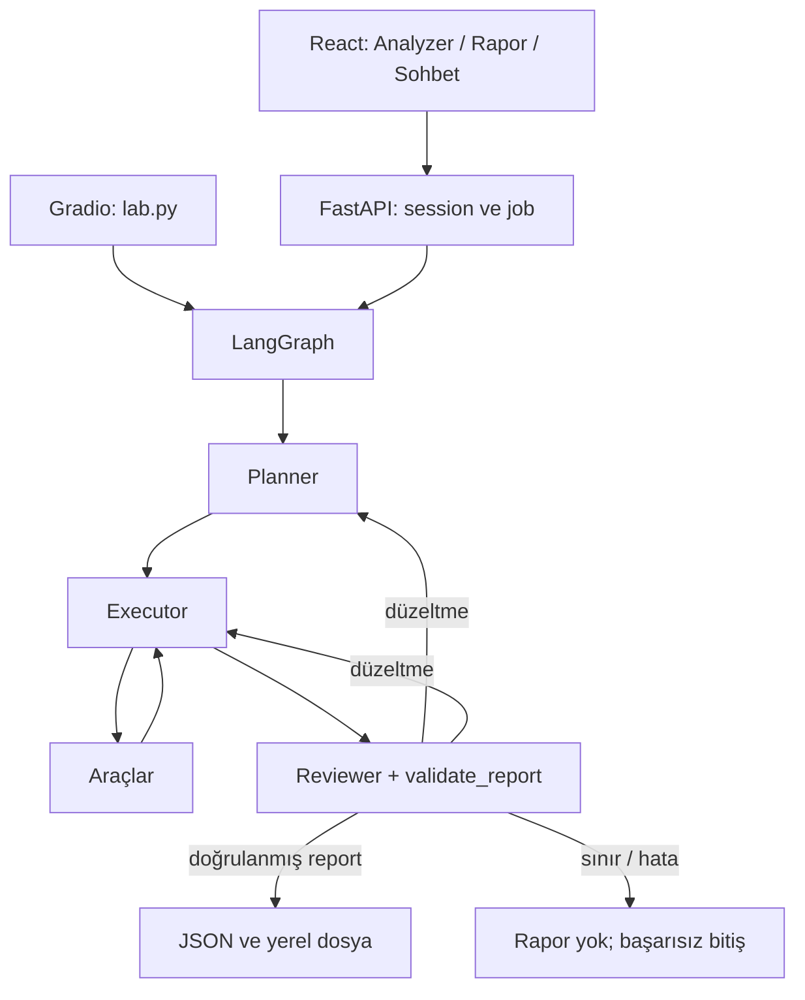

# Mimari ve test kapsamı

Bu envanter kaynak kod incelemesine dayanır; çalışma zamanı doğruluğunun kanıtı değildir. İncelenen dosyaların hash'leri [source_snapshot.json](source_snapshot.json) içindedir.

## 1. Girişten rapora mevcut akış

- React, `run_web.py → serve.py → ui_backend/server.py` üzerinden çalışır. Gradio ayrı `lab.py` ile 7860 veya web sunucusunda `/gradio` altında açılabilir. Aynı ekran sanılmamalı.
- `api.py` ASGI uygulamasını dışa aktarır. `frontend/dist` mevcut değilse kökte React arayüzü sunulmaz; README'deki “opsiyonel build” ifadesi bu koşulla okunmalıdır.
- API Analyzer doğrudan `ui_backend/lab_runs.py` kullanır; rapor/sohbet Analyzer tool'u `utils/tools.py` içindeki ayrı yükleme yolunu kullanır. Aynı model/checkpoint/ayarlar iki girişte ayrı test edilmelidir.
- `AgentState.video_path`, `conversation_messages` ve o işe ait `messages` ayrıdır. `messages` araç/denetim izi; kalıcı kullanıcı sohbeti değildir.
- Planner plan üretir, executor aracı seçip çağırır, reviewer metin kanıtını inceler. Rapor için kod ayrıca şema, süre, görsel kapsam ve gerçek eylem kayıtlarını kontrol eder.
- `MAX_TOOL_ROUNDS=8`: tekil çağrı sayısı değil, tool-node tur sayısı. `MAX_REVIEW_LOOPS=2`. Çok segmentli/çok eylemli videoda bu bütçenin yeterliliği ayrıca ölçülmelidir.
- Reviewer bağımsız bir görüntü incelemesi yapmaz. VLM metni yanlışsa onu doğrulayan ikinci bir görsel sistem varsayılamaz.

## 2. Kaynak haritası

| Katman | Dosyalar | Test odağı |
|---|---|---|
| Arayüz/taşıma | `frontend/src/App.tsx`, CSS, `ui_backend/server.py`, `contracts.py`, `lab.py` | oturum, yükleme, tek iş, SSE, iptal, hata/başarı ayrımı, JSON indirme |
| Orkestrasyon | `utils/agents.py`, `prompts.py`, `tools.py` | ortak hedef bağlamı, tool sözleşmesi, doğru sıra, bütçe, geri bildirim |
| Rapor/eylem | `utils/reporting.py`, `action_records.py` | şema, kanıt kapsamı, eylem call_id ve hedef video eşleşmesi |
| Anomali | `video_analyzer_model.py`, `fc_model.py`, `video_process.py`, `visualization_tools.py` | FPS/klip/stride, checkpoint, skor-zaman, padding, grafik |
| VLM/LLM | `utils/vlm.py`, `llm.py`, `ui_backend/lab_runs.py` | geometri, örnekleme, süre, bağımsız geçmiş, hata iletimi |
| Takip | `utils/object_tracking.py` | YOLO11/ByteTrack, her kare, kaynak koordinat/PTS, cache, tracker kapsamı |
| Plaka | `utils/plate_detection.py` | ONNX letterbox dönüşümü, kaynak PNG, kırpım manifesti, limit/temizlik |
| OCR | `utils/plate_ocr.py` | model/config sözleşmesi, hash/PNG kontrolü, belirsizlik, tam manifest |
| Arşiv/kesme | `utils/clip_archive.py`, `video_export.py` | kategori, tekrar kullanım, kategori çakışması, FFmpeg, kaynak korunması |
| Yapılandırma | `utils/env.py`, `.env.example`, requirements dosyaları | doğru dosya/öncelik, opsiyonel paket, cihaz ve ayar uyumluluğu |
| Eğitim/yardımcı | `segment_ranking_model_train.py`, `fc_model.py`, `test_main.py` | CUDA varsayımı, veri ayrımı, deterministik eval, CLI bağlamı |

## 3. Mevcut araç sözleşmeleri

| Araç | Girdi → çıktı | Yapmadığı şey / test sınırı |
|---|---|---|
| `run_abnormal_event_segmenter` | video → metadata, threshold=0.3, segmentler | olay kategorisi/plaka/kimlik çıkarmaz; sıfır segment normal garantisi değil |
| `analyze_video_with_vlm` | video + start/end + soru → örneklenen aralık, metin | tam kare taraması değil; ses transkripsiyonu değil; plaka OCR doğrulaması değil |
| `get_video_info` | video → süre/FPS/boyut | olay analizi yapmaz |
| `archive_anomaly_clip` | video + aralık + kategori + gerekçe → clip.mp4 + metadata | kendi kendine kategori seçmez; görsel kanıtı kod düzeyinde doğrulamaz |
| `save_video_segment` | video + aralık + kullanıcı çıktı yolu → MP4 | kategori arşivi değil; stream-copy kesimi kare hassasiyetinde garanti değil |
| `detect_and_track_objects` | video + aralık + COCO sınıfları + render → frames/intervals + isteğe bağlı MP4 | suç türü/plaka/gerçek kimlik belirlemez; tespit sayısı tekil araç sayısı değil |
| `detect_license_plate_regions` | video + aralık → orijinal PNG'ler + crops.json | takip manifesti/ROI/track_id girdisi yok; OCR yapmaz; her karede tekrar kırpım olabilir |
| `read_license_plate_crops` | tespit details_path → readings.json | video/tespit yeniden çalışmaz; araçla eşleştirme/tekilleştirme yapmaz |

Plaka tespiti ve OCR CPU ONNX Runtime kullanır. Takip ve Analyzer cihaz seçimi aynı değildir. Model kurulumu ilk kez ayrı yapılır; testler runtime otomatik kurulum/indirme varsaymamalı. VLM/LLM ise EVREN servisine istek gönderir; bunlar yerel inferans değildir.

## 4. Hedef zincirin mevcut karşılığı

| Bağlantı | Durum | Gerekli kabul |
|---|---|---|
| Segment → görsel yorum | Var; model kararlarına ve kapsam doğrulamasına bağlı | bulunan tüm aralıklar kapsansın; boş segmentte güvenli alternatif olsun |
| Görsel olay → kategori arşivi | Araç var; seçim LLM'e bırakılmış | kategori/gerekçe/gerçek aralık; yanlış kesinlik yok |
| Olay → ilgili araçların seçimi | Ayrı zorunlu karar kaydı yok | olayda görünme ile olaya dahil olma ayrımı; gerekçeli seç/atla kararı |
| Takip kutusu → plaka ROI | **Bağlantı yok** | orijinal kare, aynı kaynak saniyesi, araç kutusu ve plaka kutusu eşleşmeli |
| Plaka crops.json → OCR | Var | tam manifest, geçerli kırpım, zaman/koordinat/hash korunması |
| OCR → araç track_id → olay | **Yapısal bağlantı yok** | event_id + iş/video kimliği + track_id + crop referansı gerekir |
| Eylem seç/atla/başarısız gerekçesi | Yalnız yapılanlar kayıtlı | `eylemler=[]` “değerlendirildi ve gerekmedi” kanıtı değildir |

Bu tablo, yeni zincirin uygulanmış olduğunu söylemez. Z testleri hedef kabul şartlarıdır. Mevcut plaka tool'una desteklemediği `track_id` parametresi göndererek test yapılamaz. Önce ayrı araçlar doğrulanır; bağlantı geliştirildikten sonra zincir kabulü yapılır.

### Önerilen iç karar sözleşmesi (mevcut rapor şeması DEĞİL)

Her olay için `event_ref`, kaynak video kimliği/hash, aralık, kategori ve kategori belirsizliği; her ilgili araç için `tool`, `decision=run/skip/blocked`, gerekçe ve kanıt referansı; seçilen çağrılar için önkoşul ve sonuç referansı. Plaka ilişkisinde yalnız track_id yeterli değil: ID iş kapsamında olduğu için `job + video + interval + track_id` birlikte tutulmalı.

Arşiv ile takip aynı olay kanıtına dayanabilir; mutlaka birbirinin çıktısını tüketmez. OCR ise kırpım manifestine bağımlıdır. Aynı aralığı arşivlemek OCR başarısına bağlı olmamalı; OCR hatası doğru olay analizini yok etmemeli. Belirsiz nesne eşleşmesinde yanlış plaka bağlamak yerine eşleşme boş/kararsız kalmalı.

## 5. Açıklar: doğrulanmış gözlem ile hipotezi ayır

| Kimlik | Kaynak incelemesi / kullanıcı izi | Kapsayan senaryo |
|---|---|---|
| KG01 | Reviewer prompt'unda video_path yok; rapor kullanıcı mesajında da yok. Executor prompt'unda VAR: ilk araç atlamanın nedeni kesinleşmedi. | G03, G04 |
| KG02 | `segments=[]` olunca validate_report görsel kontrol zorlamıyor. | G02, R02 |
| KG03 | `generate_frames` 448×336 zorlar; 576×1024 video logda 448×320 VLM girdisine dönüşmüş. | G01, M01 |
| KG04 | `_normalize_node_update`: her dolu final_answer → “approved”; sınır mesajı da dahil. | G05 |
| KG05 | Raporun görsel/segment kanıtı, eylemlerden farklı olarak eşleşmiş call_id/araç adı zorlamadan içerik alanlarından kabul ediliyor. | R05 |
| KG06 | API Analyzer checkpoint yokluğunu reddederken agent model yükleyicisi `None` ile model kurabilir; rastgele FC ağırlık riski. | S02 |
| OBS01 | 22.4sn araç videosunda VLM yön/mesafe hakkında görüntüyle uyuşmayan normal trafik yorumu üretmiş. İki saniyelik kare incelemesi kesin çarpışma/niyet kanıtı değildir. | G01, Q01 |
| OBS02 | 03:36 izinde hiç tool yokken metadata başarısızlığı ve düşük risk taslağı üretilmiş. Kod nihai raporu reddetmiş. | G03, G04 |
| GAP01 | Eylem seç/atla kayıtları ve takip→plaka→olay ilişkisi yok. | Z01–Z08 |

Ek **test gerektiren riskler**, çalıştırılarak doğrulanmış hata sonucu olarak sunulmaz:

- S3D pencere sonunda kalan kareler atılabilir; skorlar toplam video süresine yeniden yayılıyor. Olayın son karelerde olduğu veriyle kapsam kontrolü yapılmalı (S03/S04).
- VLM uzun aralıkta 128 kare sınırı ve minimum encode FPS nedeniyle süreyi birebir koruyamayabilir; örnekleme kaçırması ve zaman açıklığı test edilmeli (M03).
- Gradio LLM/VLM sekmeleri global yöneticiler kullanıyor; API oturum düzeltmesi bu eski sekmeleri otomatik düzeltmiyor (U08).
- SSE kuyruğu tüketiliyor; kopma/yeniden bağlanmada sonuç kaybı, takılı arayüz ve iki dinleyiciyle bölünme test edilmeli (U06).
- `run_web.py` WEB_HOST/WEB_PORT'u .env yüklenmeden okuyabilir; yalnız shell export ile çalışan ayar .env desteği kanıtı değildir (X02).
- Eğitimde normal eğitim listesi tüm normal dosyalar, normal doğrulama örneği aynı listeden seçiliyor; veri sızıntısı denetimi gerekir. Fold bölmede kalan örnekler de kontrol edilmeli (T01).
- Grafik “Anomali Olasılığı” yazıyor; skorun kalibre edilmiş olasılık olduğu kanıtlanmış değil (Q03).

## 6. Doküman tutarlılığı

README ve bazı eski test belgelerinde eylemler için “daima []” ifadeleri güncel kayıt davranışıyla çelişiyor. Bu pakette gerçek tool sonuçlarına dayalı `action_records` sözleşmesi esas alınır. Eski belgeler bu görevde değiştirilmedi.
